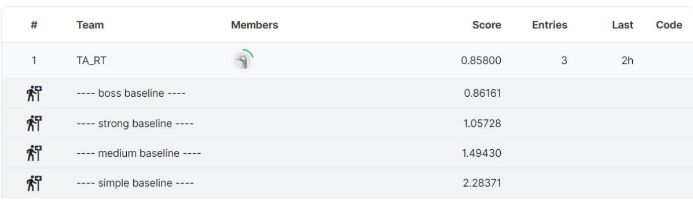

## Objectives
* Solve a regression problem with deep neural networks (DNN).
* Understand basic DNN training tips.
* Familiarize yourself with PyTorch.

## 评分线

## Hints
* simple : sample code
* medium : Feature selection
* strong : Different model architectures and optimizers
* boss : L2 regularization and try more parameters

## 我们需要改的地方
* Neural Network Model (改模型，加Dropout)
* Feature Selection (选择合适的特征)
* Training Loop (改梯度下降优化器，加weight_decay/正则惩罚项)
* Configurations (改配置)
* Dataloader (数据归一化)

## 我改了的地方
* Neural Network Model：网络层增加，激活函数改为LeakyReLU
* Feature Selection: 选了前四天的阳性来预测第五天的
* Training Loop: 改成Adam优化器
* Configurations: 改成自定义特征组

## 我的结果 (>Strong baseline)
Score: 1.08889
Public score: 1.02013

## 提交
* 把测试集生成的pred.csv文件上传到kaggle就好。